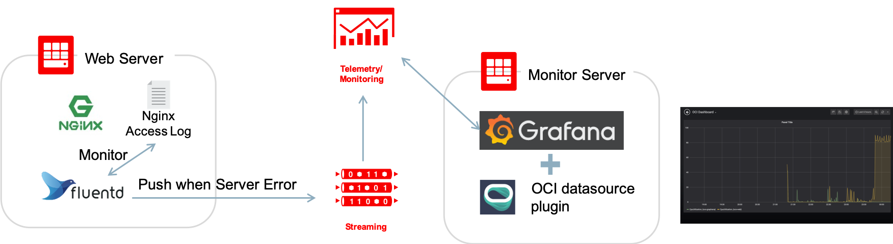

# Oracle Cloud Infrastructure Monitoring Examples 
## Case02: Streaming + Grafana 
Example of detecting logs when Web server outputs Server Error, pushing to OCI streaming, and monitoring with monitoring visualization tool (Grafana)



## How to run

1. Set env-vars
In this file, you should write necessary information (like below) in order to build cloud environments by terraform.

- User Credentials (user_ocid, fingerprint ..etc)
- Region
- ssh_key files
- and so on...

[env-vars-sample](./env-vars-sample) is a good exaple.

2. Load env-vars

```
$ source env-vars
```

3. Run Terraform

```
# Init
$ terrafrom init

# Plan
$ terraform plan

# Apply
$ terraform apply
```

4. Provision Environments 

```
$ terraform apply -var 'provision=true'
```

5. Run auto web requests (return 502 Error)

```
$ terraform apply -var 'exec_web_request=true'
```

6. Check Monitoring, Alarm Status and Grafana Dashboard 

7. Clean environments

```
$ terraform destroy
```

